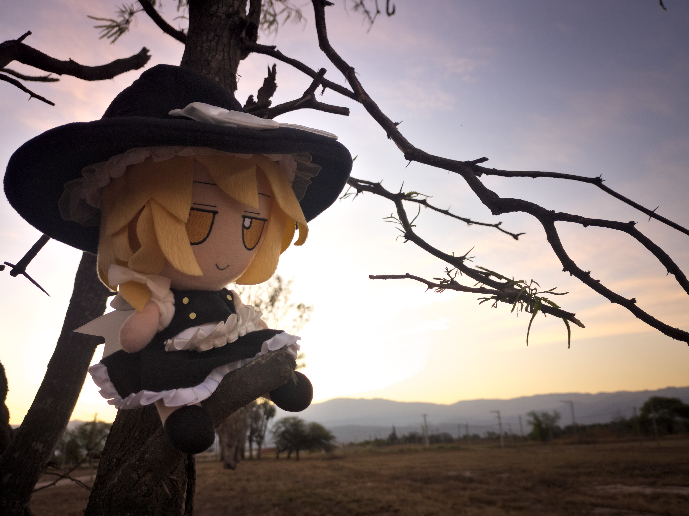
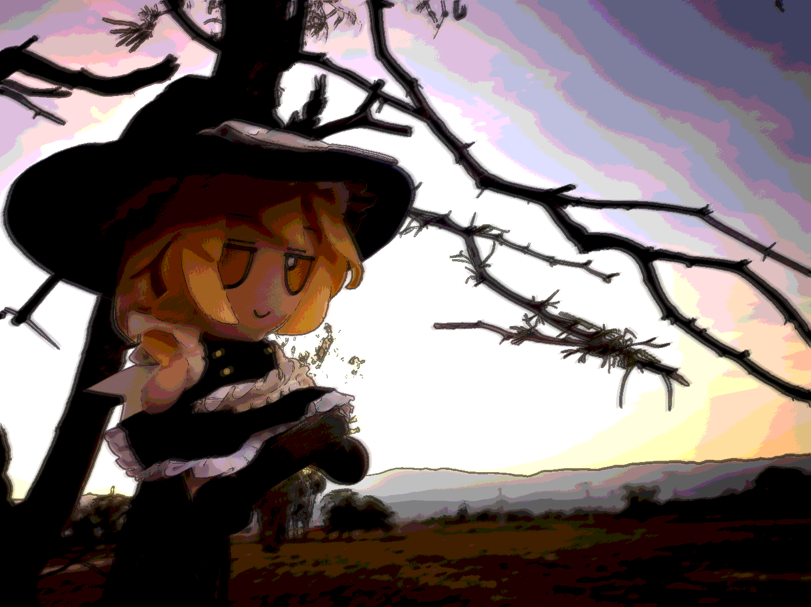

# Higurashifier
Simple image processing script to apply a higurashi background style filter to an image.

Based on rwbyrocks [higurashify](https://github.com/rwbyrocks/higurashify).

## Process
We cut apply a preprocessing step for resizing and/or cropping the image, and then we pass it through
a pipeline with 5 steps (every step can be optional).

In order:

### Contrast stretching
When provided a white contrast level percentage $`w`$, we can derive:

$$b = 1 - w$$
$$w_c = w \times 255$$
$$b_c = b \times 255$$
$$s = \frac{255}{w_c - b_c}$$

Then for each RGB channel $`c`$, we apply the following transformation:

$$c' = clamp((c - b_c) \times s, 0, 255)$$

### (Un)Sharpening
We apply an unsharpening mask using a 1D box blur with radius $`r = 2`$.

When provided a sharpening amount percentage $`a`$, we apply for each RGB channel $`c`$ the following
transformation:

$$c' = clamp(c + a \times (c - blur(c)), 0, 255)$$

### Motion blur
We copy the main image and apply a directional box blur. The user provides as arguments the blur
direction angle $`a`$ (in degrees), the blur radius $`r`$, and the blur opacity $`o`$. We can derive:

$$\theta = a \times \frac{\pi}{180}$$
$$dx = cos \theta$$
$$dy = sin \theta$$

For each pixel $`(x, y)`$, we sample and average around the line

$$(x + k \times dx, y + k \times dx)$$
$$ k \in [-10, 10]$$

Then we alpha blend the blurred result over the image; for each RGB channel $`c`$ we apply:
$$c' = clamp(c \times (1 - o) + blur(c) \times o, 0, 255)$$

### Posterization
We apply a simple color quantization over every pixel. The user provides the quantization level $`l`$
and we derive

$$s = \frac{255}{l - 1}$$

Then for each RGB channel $`c`$, we apply the following transformation:

$$c' = round(\frac{c}{s}) \times s$$

### Edge detection
First, we generate a grayscale image from the original unprocessed pixels. For each RGB value in each
pixel in the image:

$$P = 0.30 \times R + 0.59 \times G + 0.11 \times B$$

We apply an edge detection kernel over the grayscale image, any of the following:
- Sobel
- Laplacian
- Roberts
- Prewitt

The user provides a max threshold value $`t`$ for the edge mask $`E`$ and invert the output (if
we prefer white edges).

$$E' = 255 \hspace{4px} if E > t \hspace{4px} else \hspace{4px} 0$$
$$E_{mask} = 255 - E'$$

Finally we multiply blend the edge mask with the image, the user defines the edge opacity percentage
$`o`$. For each RGB channel $`c`$:

$$B = \frac{c}{255}$$
$$L = \frac{E_{mask}}{255}$$
$$c' = clamp(255 \times (B \times (1-o) + B \times L \times o), 0, 255)$$

### Original image

    

### Result

    

Parameters:
- aspect: `original`
- max-height: `1080`
- contrast-level: `85.0`
- blur-angle: `-25.0`
- blur-opacity: `0.8`
- blur-radius: `9`
- edge-method `sobel`
- edge-threshold: `80.0`
- edge-opacity: `0.5`
- unsharpening: `1.0`
- quantization: `9`
